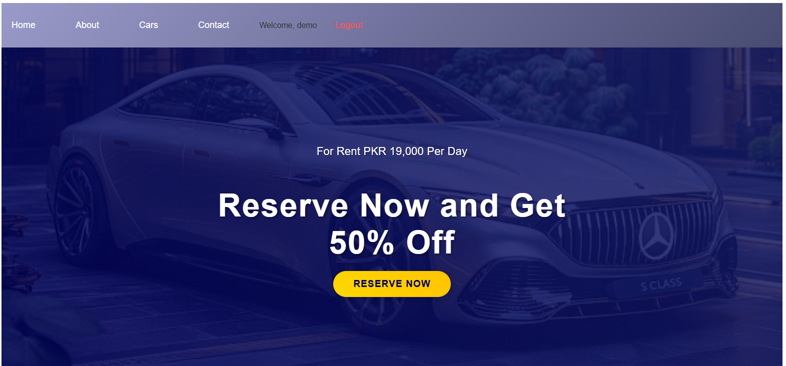
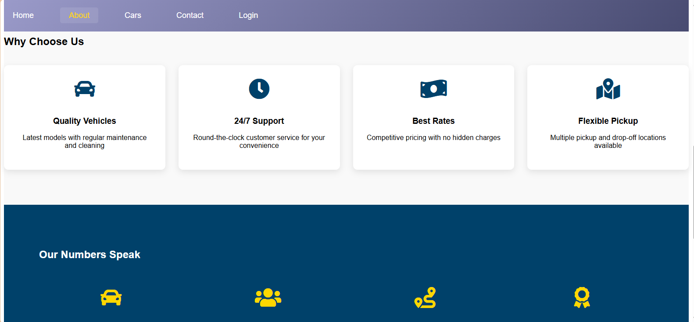
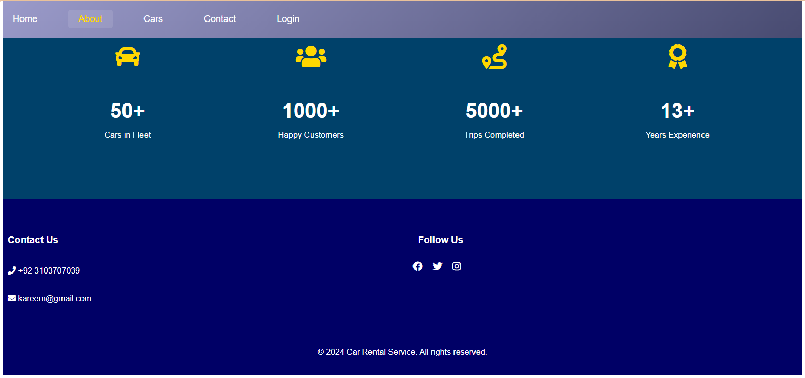
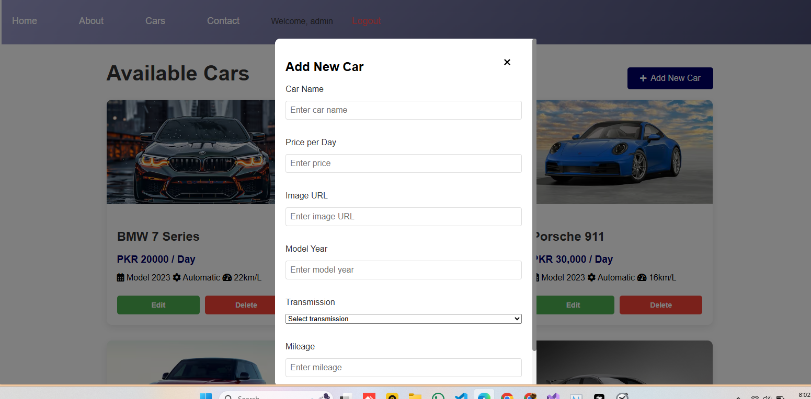
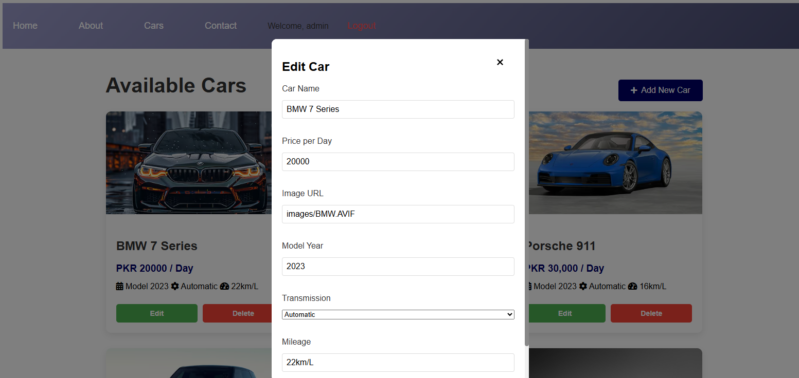
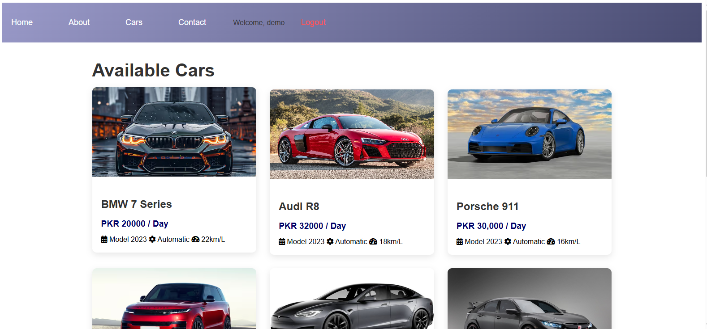
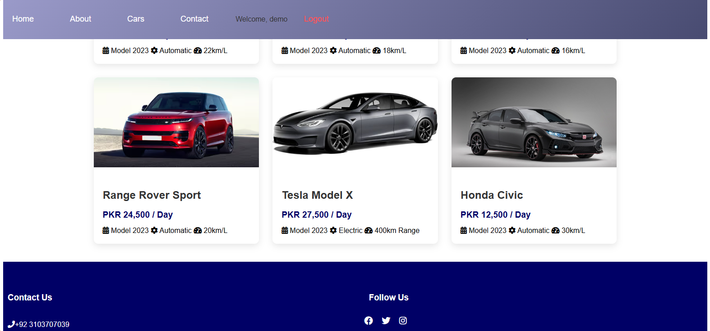

      <h1>Car Rental Service</h1>
      <h3>Your Premium Car Rental Solution</h3>

    

# 📌Overview

A modern car rental platform that allows users to browse, book, and manage premium vehicles with ease. Administrators can manage the car fleet through a comprehensive dashboard.

# 🛠️ Tech Stack

## 📸 Screenshots

### Home Page

  
  
  
  
<em>Dynamic homepage showcasing premium vehicles and special offers</em>

### About Section

  
  
  
  
  
<em>Our company story, services, and achievements</em>

### Admin Interface

  
  
  
  
<em>Comprehensive fleet management for administrators</em>

### User Experience

  
  
  
<em>User-friendly car browsing interface</em>

### Contact Features

  
  
  
  
<em>Get in touch with our team</em>

### Authentication

  
  
<em>Secure user authentication system</em>

## Demo Credentials

### Admin Account

- Email: admin@gmail.com
- Password: 1234
- Role: Administrator

### Demo User Account

- Email: demo@gmail.com
- Password: 1234
- Role: User

## 🚀 Key Features

### User Management

- Role-based authentication system
- Secure login functionality
- User-specific car viewing permissions

### Car Fleet Management (Admin)

- Add new vehicles to the fleet
- Edit existing car details
- Delete vehicles from inventory
- Manage car images and specifications

### Car Rental Features

- Browse available cars
- View detailed car specifications
- Search functionality
- Price per day information
- Transmission and mileage details

### Additional Features

- Responsive design
- User-friendly interface
- Form validation
- Secure authentication
- Car image support
- Hot offers section
- Contact form

## Project Structure

## 🙏 Acknowledgments

- [HTML5](https://developer.mozilla.org/en-US/docs/Web/HTML)
- [CSS3](https://developer.mozilla.org/en-US/docs/Web/CSS)
- [JavaScript](https://developer.mozilla.org/en-US/docs/Web/JavaScript)
- [MockAPI](https://mockapi.io/) for backend services
